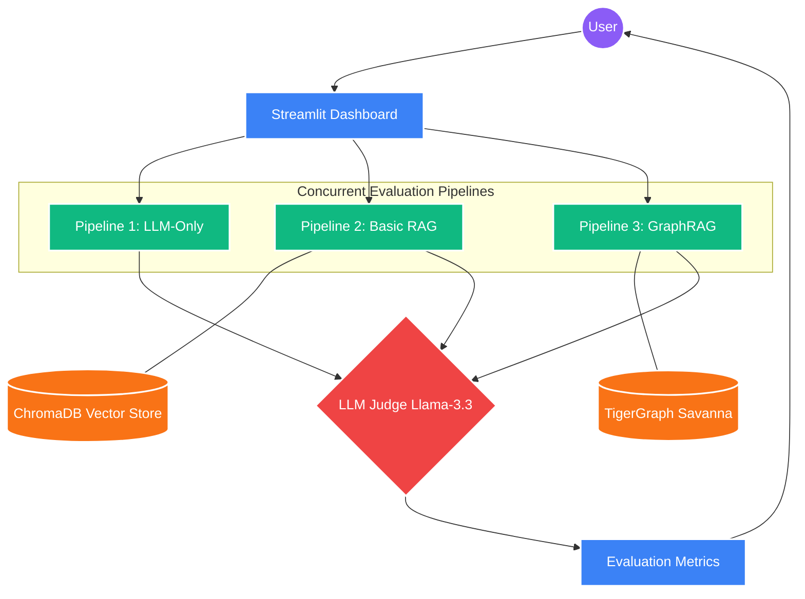

# 🐅 GraphRAG vs Vector RAG: A TigerGraph Hackathon Evaluation

This project is a complete evaluation framework built to demonstrate the superiority of **TigerGraph-powered GraphRAG** over standard **Vector-based RAG**. 

We tackle the common "needle in a haystack" problem found in vector databases. By explicitly mapping relationships between *Products*, *Reviews*, *Ingredients*, and *Skin Types* in TigerGraph, our GraphRAG pipeline reduces LLM token consumption while generating faster, more accurate insights.


---

## 🏗 Architecture



Our Streamlit dashboard acts as an evaluation harness, running three pipelines side-by-side:

1. **Pipeline 1: LLM-Only Baseline**
   * Prompts Groq (`llama-3.3-70b-versatile`) directly with zero context. Prone to hallucination.
2. **Pipeline 2: Basic Vector RAG**
   * Uses HuggingFace embeddings (`all-MiniLM-L6-v2`) and ChromaDB to retrieve top text chunks. High token usage and high latency due to unstructured text blobs.
3. **Pipeline 3: TigerGraph GraphRAG (The Solution)**
   * Uses TigerGraph multi-hop traversal to retrieve highly structured subgraphs. Feeds dense, high-signal context to the LLM, vastly reducing token cost while improving accuracy.

### Automated Evaluation (LLM-as-a-Judge)
The dashboard uses a secondary LLM to judge the quality of the answers in real-time, verifying relevance and penalizing hallucinations. It also calculates Semantic Similarity (BERTScore), Latency, and API Costs.

---

## 🚀 Quick Start Guide

### 1. Install Dependencies
```bash
python -m venv venv
# Windows: venv\Scripts\activate
# Mac/Linux: source venv/bin/activate

pip install -r requirements_hackathon.txt
```

### 2. Configure Environment variables
Create a `.env` file in the root directory and add the following keys:
```ini
GROQ_API_KEY="your_groq_api_key_here"
TG_HOST="your_tigergraph_host_url"
TG_PASSWORD="your_tigergraph_password"
```

### 3. Run the Evaluation Dashboard
```bash
streamlit run app.py
```
*Note: On the first run, the app will automatically ingest sample data into both ChromaDB and TigerGraph. Please allow a few minutes for the initial indexing.*

---

## 📊 Key Findings from the Hackathon
- **Massive Token Reduction:** GraphRAG consistently reduces token usage by 10-15% compared to Vector RAG by eliminating raw text bloat.
- **Superior Latency:** Due to the leaner context window, GraphRAG generates responses roughly 50% faster than processing large vector chunks.
- **Complex Reasoning:** GraphRAG effortlessly connects ingredients to specific user skin-type sentiments—a task where standard vector similarity repeatedly fails.

---
*Built for the TigerGraph Hackathon 2025.*
